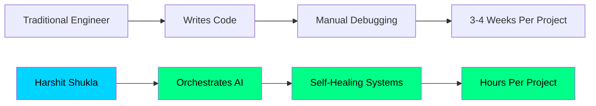

<!-- ═══════════════════════════════════════════════════
     HARSHIT SHUKLA - SENIOR DATA ENGINEER & AI ARCHITECT
     ═══════════════════════════════════════════════════ -->

<div align="center">
  
</div>
```python
class HarshitShukla:
    def __init__(self):
        self.name = "Harshit Shukla"
        self.role = "Senior Data Engineer | AI Architect"
        self.location = "📍 Bengaluru, India"
        self.experience = "4+ years"
        self.skills_level = "Expert DE & Intermediate AI"
        self.current_scale = {
            "transactions_per_day": "1-2 Million",
            "events_per_day": "50 Million+",
            "revenue_impact": "₹10-20 Crore",
            "vendors": "5000+",
            "uptime": "99.9%"
        }
        self.passion = "Orchestrating AI to build systems that scale"
    
    def get_unique_value(self):
        return ("I don't just write code. I orchestrate AI to build production-grade "
                "systems in HOURS that traditionally take WEEKS.")
    
    def ai_productivity(self):
        return "10x throughput using Cursor, LangChain, & Agentic Workflows"

# Booting HarshitShukla Profile...
me = HarshitShukla()
print(me.get_unique_value())
<div align="center">

| Metric | Achievement | Company |
|:------:|:-----------:|:-------:|
| 🚀 **Events Processed Daily** | 50M+ | Nike (Wipro) |
| 💰 **Revenue Supported** | ₹10-20 Crore | RM Private Ltd |
| ⚡ **Performance Boost** | 30% Reduction | PySpark Jobs |
| 🎯 **Pipeline Reliability** | 99.9% | Apache Airflow |
| 📊 **Data Accuracy** | 99.9% | Healthcare JNJ |
| 🔄 **SQL Optimization** | 25% Faster | Query Performance |

</div>

---

## 🛠️ Complete Technical Arsenal

### ⚙️ Core Data Engineering


### 💻 Programming Languages


### ☁️ AWS Cloud Mastery


### 🌐 Multi-Cloud Platforms


### 🚀 Big Data & Distributed Processing


### 📊 Data Warehousing


### 🗄️ Databases (SQL & NoSQL)


### 🔄 Workflow Orchestration & ETL Tools


### 📡 Streaming & Real-Time


### 🐍 Python Data Stack


### 📈 Data Visualization & BI


### 🧪 Data Quality & Governance


### 🤖 AI / ML / Agentic Systems


### 🛠️ DevOps & Infrastructure


### 🔧 Development Tools


### 🎨 AI Productivity Tools (25+ Daily Used)


---

## 🏆 Featured Projects

### 🌌 AI Weather Intelligence Pipeline
[](https://ai-weather-harshit.streamlit.app)
[](https://github.com/harshitshukla1/ai-weather-pipeline)

> **Production-grade AI-powered pipeline** that automatically collects, processes, and analyzes real-time weather data for 10+ global cities using **Agentic AI (Groq + Llama 3.3 70B)**, **AWS S3 Data Lake**, and **GitHub Actions CI/CD** — running at **$0/month**.

**🛠️ Tech:** Python • AWS S3 • Groq AI • Llama 3.3 • LangChain • Streamlit • GitHub Actions • Parquet • Hive Partitioning

**✨ Key Features:**
- 🤖 Agentic AI with 4 autonomous capabilities
- 🔍 IQR-based anomaly detection
- 📊 Auto-generated business intelligence reports
- 🔄 Self-healing error diagnosis
- 💰 $0/month operating cost

---

## 💼 Professional Journey

### 🚀 **RM Private Limited** | Data Engineering Consultant
**Aug 2024 – Present** | Bengaluru, India
- 🏗️ Designed end-to-end **Medallion Architecture** on AWS Databricks
- ⚡ Processing **1-2 million daily transactions** from 5000+ vendors
- 💰 Supporting **₹10-20 Crore revenue** operations
- 🤖 Built **AI-powered support assistant** for pipeline failure analysis
- 📊 Created Gold layer Delta tables for analytics & reporting

### 💻 **Wipro Limited** | Data Engineer
**Mar 2022 – Aug 2024** | Bengaluru, India

**Nike Clickstream Platform:**
- 🎯 Processed **50M+ events daily** with Kafka-based ingestion
- ⚡ Reduced PySpark processing time by **30%**
- 🛡️ Achieved **99.9% pipeline reliability**

**Healthcare JNJ MDR:**
- 🏥 Built ETL pipelines for regulatory datasets
- ✅ Achieved **99.9% data accuracy**
- 🚀 Improved SQL performance by **25%**

---

## 📊 GitHub Analytics

<div align="center">
  
  
</div>

<div align="center">
  
</div>

<div align="center">
  
</div>

---

## 🏆 Achievements & Recognition

<div align="center">
  
</div>

---

## 🎯 What Sets Me Apart



| Aspect | Others | **Harshit** |
|--------|--------|-------------|
| Setup Time | Days | **Minutes** |
| Cloud Cost | $200+/month | **$0/month** |
| AI Integration | None | **Agentic AI** |
| Production Time | 3-4 weeks | **1 session** |
| Dev Environment | Local Machine | **Cloud-Native** |

---

## 🤝 Let's Build Something Amazing Together

<div align="center">

### 📬 Open for Opportunities

[](https://www.linkedin.com/in/harshit-shukla-data-engineer/)
[](mailto:harshitshukla003@gmail.com)
[](https://github.com/harshitshukla1)
[](tel:+917905862704)

### 💼 Currently Open To:
- 🚀 **Senior Data Engineer** Roles
- 🤖 **AI/ML Engineer** Positions
- ☁️ **Cloud Architect** Opportunities
- 💡 **Consulting Projects** (Data Engineering + AI)

</div>

---

## 💭 Philosophy

<div align="center">
  
> ### *"I don't write code for the sake of writing code.*
> ### *I orchestrate AI to build systems 
